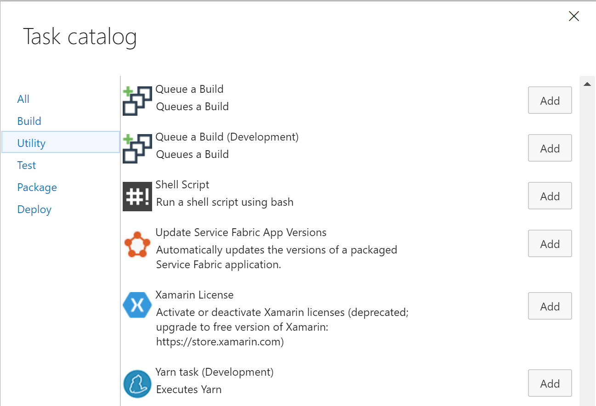
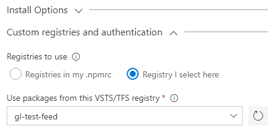

# Ghost Build and Release Tasks

[Ghost](https://ghostpkg.com/) is an amazing blogging platform. It is fast, reliable and now has an amazing editing experience. 

With this extension you can automate the publication of a theme to a Ghost blog instance. 

> Note: We support only ghost 1.24 and above

[Learn more](https://github.com/geeklearningio/gl-vsts-tasks-ghost/wiki) about this extension on the wiki!

## Tasks included

* **[Ghost theme uploader](https://github.com/geeklearningio/gl-vsts-tasks-ghost/wiki/Ghost-Theme-Uploader)**: Uploads a theme to ghost.

> TFS 2015 is not supported.

## Steps

After installing the extension, you can add one (or more) of the tasks to a new or existing [build definition](https://www.visualstudio.com/en-us/docs/build/define/create) or [release definition](https://www.visualstudio.com/en-us/docs/release/author-release-definition/more-release-definition)

Starting with version `1.x`, you can configure custom registries directly in the task settings:

## Learn more

The [source](https://github.com/geeklearningio/gl-vsts-tasks-ghost) for this extension is on GitHub. Take, fork, and extend.

## Known Issues

Please refer to our [wiki page on Github](https://github.com/geeklearningio/gl-vsts-tasks-ghost/wiki/Known-Issues)

## Release Notes

Please refer to our [release page on Github](https://github.com/geeklearningio/gl-vsts-tasks-ghost/releases)
